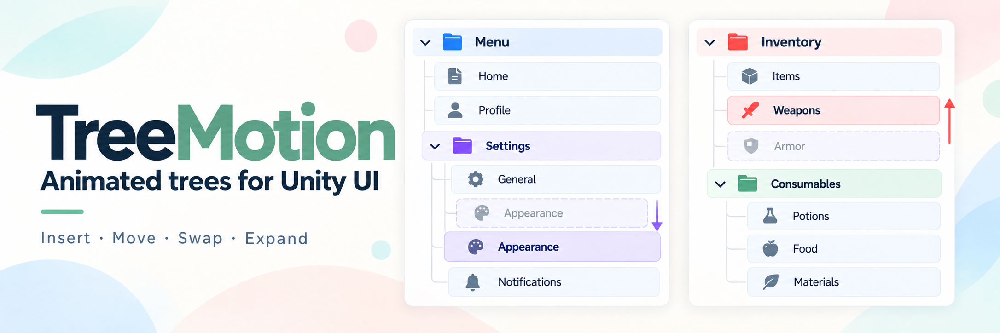
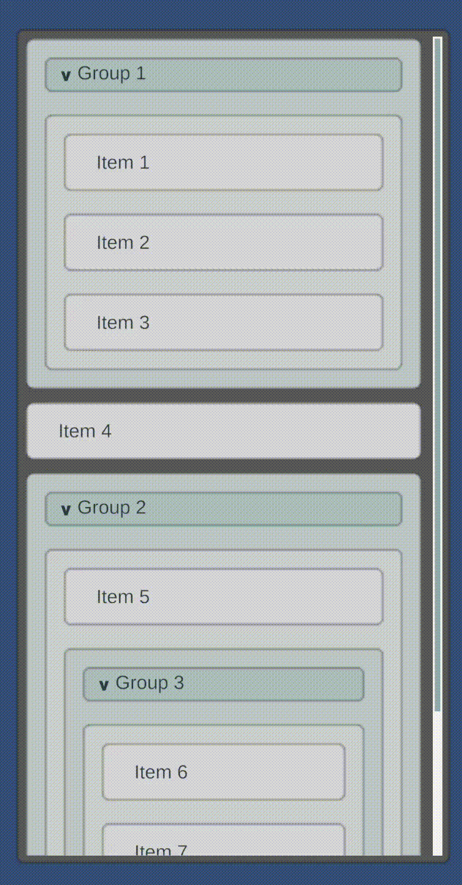
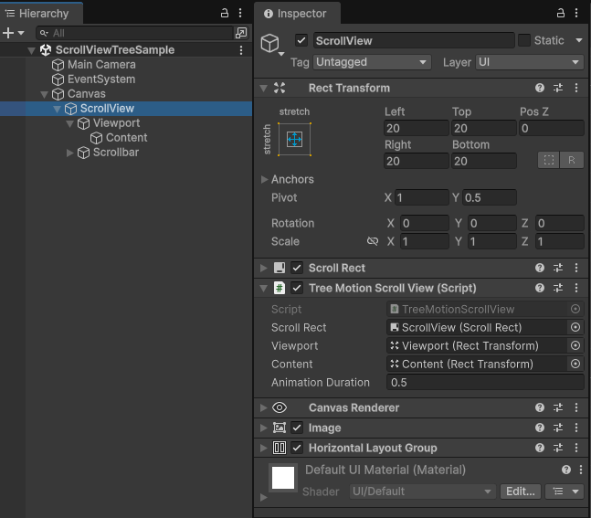
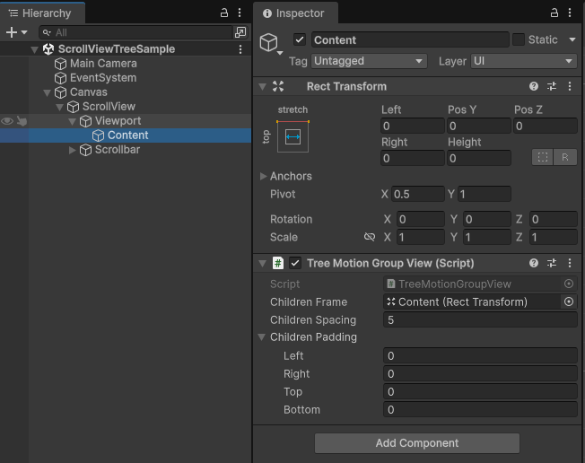

# Tree Motion

[English](README.md) | [日本語](README.ja.md)

Unity uGUI向けの、階層構造の変更をアニメーションで表示する仮想化ツリービューです。

ツリー全体を置き換えずに、Nodeの追加・削除・移動・Swap・開閉を行えます。
ユニークなIDでデータを識別し、ViewはPrefab単位で再利用されます。



## 主な機能

- Groupを多階層にネストでき、GroupごとにPrefab・子要素の間隔・余白を設定できます。
- 追加・削除・移動・Swap・開閉・Itemサイズ変更のアニメーション。
- Viewportによる表示対象の絞り込みと、Prefab参照ごとのプール。
- PrefabのAnchorとPivotを使った固定幅・ストレッチ配置。
- 変更の一括適用と、ノードごとのサイズ指定。
- 操作ごとのduration指定と、標準Taskによる完了待機。
- 任意で追加できるフェード・操作制御・独自の表示演出。

## インストール

UnityのPackage Managerで **Add package from git URL** を選び、次の形式で指定します。

```text
https://github.com/kurobon-jp/TreeMotion.git?path=Packages/com.github.kurobon.tree-motion/
```

## ScrollViewの構成

```text
ScrollView                  ScrollRect + TreeMotionScrollView
└─ Viewport                 RectTransform + ViewportのMask
   └─ Content               RectTransform + TreeMotionGroupView
```

TreeMotionScrollViewにScrollRect・Viewport・Contentを割り当てます。
ContentのTreeMotionGroupViewでは、ChildrenFrameに **Content自身** を指定します。
ChildrenSpacingとChildrenPaddingが最上位の配置を制御します。
Contentはレイアウト用のコンテナで、データ上のNodeではありません。

 

末端ItemのPrefabにはRectTransformと利用側のBind用コンポーネントを用意します。
GroupのPrefabにはTreeMotionGroupViewと、垂直軸ストレッチの **ChildrenFrame** を用意します。

```text
Group prefab                TreeMotionGroupView
├─ Header                   任意の見出しUI
└─ ChildrenFrame            両軸ストレッチのRectTransform
```

ChildrenFrameのInsetで見出しや装飾の領域を確保し、子の間隔とPaddingは親Group側で指定します。
GroupのサイズはFrameのInsetと子の占有範囲から計算されます。

実行時のGroup Viewと子Viewは、すべてContent直下に配置されます。
ChildrenFrameは配置領域を定義するもので、生成された子Viewの親にはなりません。

## データとPrefabを提供する

`ITreeMotionAdapter<TId, TItem>`を実装し、Prefab選択・サイズ取得・UIのBindを行います。
データ保持はTreeStore、UIへの橋渡しはAdapter、接続先への変更適用はTreeMotionBindingが担当します。
次の例はItemに持たせたenumからPrefabを選択し、各PrefabにTMPラベルが1つある構成です。

```csharp
public enum EntryKind { Item, Group }

public sealed class Entry
{
    public string Label;
    public EntryKind Kind;
    public float Size;
}

public sealed class EntryAdapter : TreeMotion.ITreeMotionAdapter<int, Entry>
{
    public UnityEngine.GameObject ItemPrefab;
    public UnityEngine.GameObject GroupPrefab;

    public UnityEngine.GameObject GetItemPrefab(int id, Entry item)
        => item.Kind == EntryKind.Group ? GroupPrefab : ItemPrefab;
    public float GetItemSize(int id, Entry item) => item.Size;

    public void Bind(UnityEngine.GameObject view, int id, Entry item,
        TreeMotion.VisibleRow<int> row)
    {
        // 利用側のUIコンポーネントに合わせてBindします。
        view.GetComponentInChildren<TMPro.TMP_Text>().text = item.Label;
    }
}
```

GetItemPrefabで使用するPrefabを直接返します。NodeのIDは識別だけに使い、見た目の判定には使いません。
GetItemSizeはUpdateやMove後も含め、レイアウト計算時に末端Itemごとに呼ばれます。
同じPrefabでも異なるサイズを返せます。
GroupのサイズはTreeMotionが計算するため、Group Prefabに対してGetItemSizeは呼ばれません。

初期ツリーを読み込み、ScrollViewに接続します。

```csharp
using TreeMotion;

var tree = new TreeStore<int, Entry>();
tree.LoadSnapshot(new[]
{
    new TreeNodeRecord<int, Entry>(1,
        new Entry { Label = "Group", Kind = EntryKind.Group }, isExpanded: true),
    new TreeNodeRecord<int, Entry>(2,
        new Entry { Label = "Item", Size = 40f }, parentId: 1)
});

var adapter = new EntryAdapter { ItemPrefab = itemPrefab, GroupPrefab = groupPrefab };
var binding = scrollView.Bind(tree, adapter);
```

Bindの戻り値`TreeMotionBinding<TId>`は、Apply・Reload・Refresh・完了待機を行う接続ハンドルです。
UIのViewそのものではありません。再Bindすると以前の接続を破棄し、待機中のTaskをキャンセルします。
以後の更新には新しいBindingを使います。

scrollView・itemPrefab・groupPrefabには、利用側のScene／Prefab参照を指定します。
parentIdを省略するとRoot、指定すると子になります。IDの0に特別な意味はありません。
兄弟の順序は入力順です。明示的な順序が必要な場合はsiblingIndexを指定できます。
子のレコードが親より先にあっても読み込めます。IDの重複・親の欠落・循環は拒否します。

## ツリーを更新する

変更をTreeStoreにCommitしてから、Viewに適用します。

```csharp
var changes = tree.BeginUpdate()
    .Insert(1, 3, new Entry { Label = "New item", Size = 56f })
    .Update(2, new Entry { Label = "Updated item", Size = 64f })
    .Commit();

binding.Apply(changes, duration: 0.4f);
```

ほかにRemove(id)・Move(id, parentId, index)・MoveToRoot(id, index)・
Swap(firstId, secondId)・Expanded(id, expanded)を使えます。
GroupのMove／Swapは子孫ごと移動します。Swapでも各NodeのID・Item・開閉状態は維持されます。
祖先と子孫のSwapは拒否します。演出中はMove／Swap対象とその子孫を前面に表示します。

初期化や全置き換えにはLoadSnapshot、その後の変更にはBeginUpdateを使います。
Snapshotを置き換えた後はview.Reload()を呼びます。
binding.Refresh(id)は選択状態などの表示だけを再Bindする用途です。
Itemのサイズや内容を変更する場合はUpdateを使います。

## 操作一覧

`tree.BeginUpdate()`で変更を開始し、次の操作を追加してから`Commit()`を1回呼びます。
返された変更を`binding.Apply`または`binding.ApplyAsync`へ渡すと表示が更新されます。
Commitだけではデータの更新に留まり、接続先のUIは更新しません。

| 操作 | API | 動作 | アニメーション・注意点 |
| --- | --- | --- | --- |
| **Insert** | `Insert(parentId, id, item, index = -1, isExpanded = false)` <br/> `InsertRoot(id, item, index = -1, isExpanded = false)` | 子または最上位のNodeを追加します。IDは重複できません。index省略時は末尾、`0`は先頭です。同じバッチでGroupとその子を追加できます。 | 表示対象には登場演出が適用され、周囲のNodeとGroupのサイズが動いて領域を確保します。閉じたGroupへ追加した子は、Groupを開くまで表示されません。 |
| **Remove** | `Remove(id)` | Nodeと**その子孫すべて**をTreeStoreから削除します。 | 表示中のViewは退出演出後にプールへ返り、周囲のNodeは空いた領域を詰めます。退出中はViewが残っていても、データは削除済みです。 |
| **Move** | `Move(id, parentId, index = -1)` / `MoveToRoot(id, index = -1)` | ID・Item・開閉状態・子孫を維持して、親や並び順を変更します。indexは元の位置から対象を取り除いた後の移動先リストに対する位置です。 | 現在位置から移動先へ補間し、Depth変更による横位置・横幅の変化も含みます。対象と子孫を前面に表示します。閉じた領域への出入りでは非表示／登場に切り替わります。自分の子孫への移動は拒否します。 |
| **Expanded** | `Expanded(id, isExpanded)` | `true`で子を表示し、`false`で閉じます。**データは削除せず**、子孫自身の開閉状態も維持します。 | Groupのサイズと周囲の配置がアニメーションします。表示対象に出入りする子にはEntering／Exitingの演出情報が渡されます。 |
| **Update** | `Update(id, item)` | ID・親・子・開閉状態を維持してItemを置き換えます。AdapterからPrefabと末端Itemのサイズを再取得し、表示を再Bindします。 | サイズが変わればアニメーションし、内容だけの変更は即座に反映します。Prefab変更時は新しいPrefabのViewへ交換します。**見た目は即座に切り替わり**、退出・登場やクロスフェードは自動では行いません。 |
| **Swap** | `Swap(firstId, secondId)` | 異なる親の間も含めて、2つのNodeの位置を交換します。Item・開閉状態・子孫を伴って移動します。 | 演出中は双方の対象と子孫を前面に表示します。Prefabが変わらなければViewの同一性も維持します。同一ID同士、および祖先と子孫の組み合わせは拒否します。 |

Prefabの定義とプールはPrefab参照ごとに管理します。同じPrefabを返すUpdateではViewを維持します。
子を持つNodeはGroup Prefabを選択する必要があります。

## アニメーション完了を待つ

```csharp
await binding.ApplyAsync(changes, duration: 0.4f, cancellationToken: token);
PlayNextEffect();
```

- durationを省略するとScrollViewの設定値を使います。0なら即時反映します。
- 空の変更やアニメーション不要の操作は、完了済みTaskを返します。
- 後続のApply／ApplyAsync・Reload・Adapter変更・View破棄で以前の待機をキャンセルします。
- Tokenキャンセルは待機だけを止めます。開始済みのアニメーションは継続します。
- キャンセル済みTokenではViewへの適用を行いません。Commit済みのデータ更新は元に戻しません。

UniTaskを使用する場合は、返されたTaskを.AsUniTask()で変換できます。
パッケージ自体はUniTaskに依存しません。

## 表示演出をカスタマイズする

TreeMotionは配置とプールを管理します。CanvasGroupの自動追加や、alpha・scale・操作可否の変更は行いません。
必要なPrefabに **TreeMotionFade** を追加します。登場・退出時のフェードと、アニメーション中のRaycast抑止を行います。

独自の演出を追加するには、ITreeMotionPresentationHandlerを実装したコンポーネントをPrefabのルートGameObjectに追加します。

```csharp
using TreeMotion;
using UnityEngine;

public sealed class Scaling : MonoBehaviour, ITreeMotionPresentationHandler
{
    public void ResetPresentation()
    {
        transform.localScale = Vector3.one;
    }

    public void SetTreeMotionPresentation(in TreeMotionPresentation presentation)
    {
        var scale = presentation.Cause switch
        {
            TreeChangeKind.Expand => presentation.Progress,
            TreeChangeKind.Collapse => 1f - presentation.Progress,
            _ => 1f
        };

        transform.localScale = new Vector3(1f, scale, 1f);
    }
}
```

PrefabのルートGameObjectにScalingを追加します。
この例はGroupの展開・折り畳み時に縦方向のスケールを変更し、それ以外は等倍で表示します。

変更の種類・Entering／Visible／Exiting・線形の進行度が渡されます。
`presentation.Cause`は`TreeChangeKind`で演出の原因（Insert・Remove・Expand・Collapse・Move・Swap・Update）を返します。原因がない場合はnullです。
たとえば、追加は`Role = Entering, Cause = Insert`、Groupを開いた際の子の登場は`Role = Entering, Cause = Expand`です。
ResetPresentationはプール返却／再利用時に状態を戻します。
異なるプロパティを操作するハンドラーは併用できます。

## 現在の対応範囲

- 配置方向は縦です。横位置・横幅はPrefabのAnchor／Pivotに従います。
- テキストの折り返しによる高さは自動計測しません。Adapterが末端Itemのサイズを提供します。
- データ上の親子関係と、Unity上のGameObjectの親子関係は一致しません。

